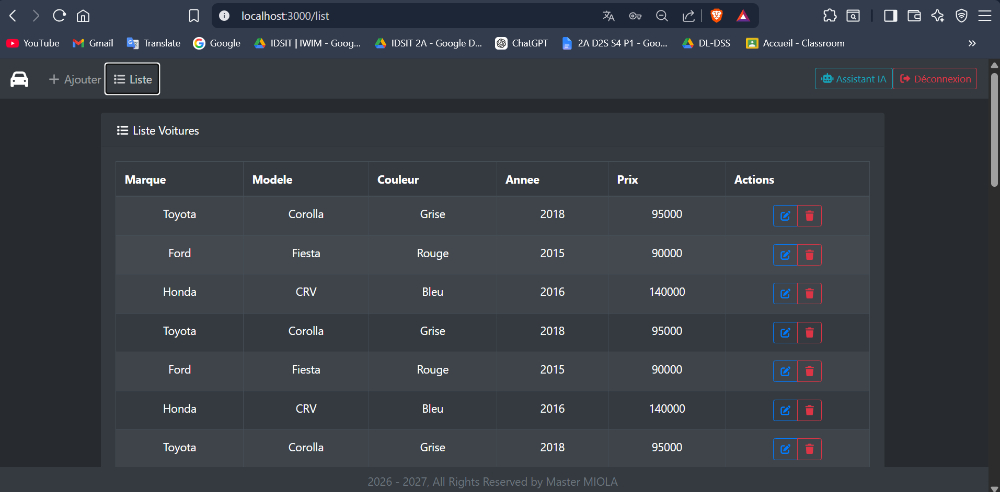
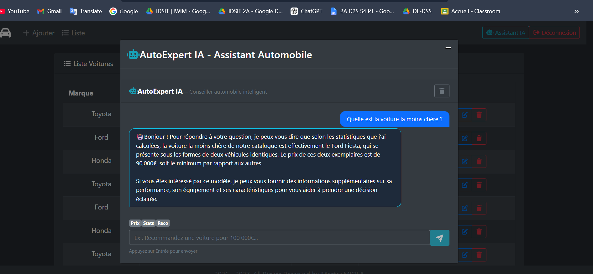
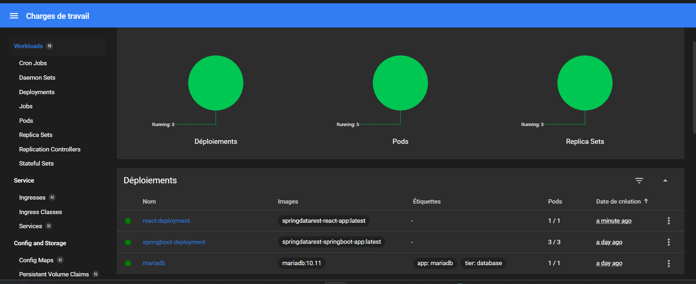
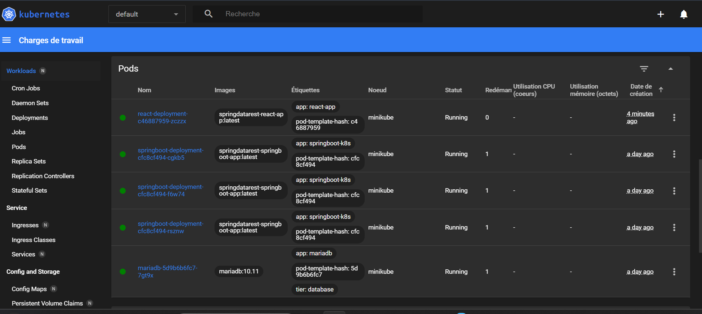
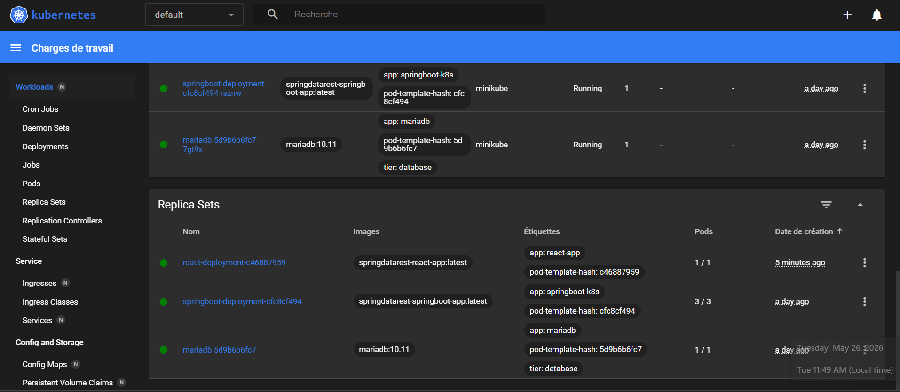

# 🚗 Gestion de Magasin de Voitures

> Projet Full Stack — ENSIAS 2025/2026  
> **Réalisé par :** Meryem ElBiach  
> **Encadrant :** Pr. Khalid Nafil

Application complète de gestion d'un magasin de voitures avec assistant IA intégré, authentification JWT et déploiement Docker.

---

## Stack technique

| Couche | Technologie |
|---|---|
| Frontend | React 18 + React Bootstrap |
| Backend | Spring Boot 3.4.5 + Java 21 |
| Base de données | MariaDB 10.11 |
| IA | Ollama + llama3.2 (Spring AI) |
| Sécurité | Spring Security + JWT |
| API Docs | Swagger UI (Springdoc) |
| Déploiement | Docker + Docker Compose + Kubernetes (Minikube) |

---

## Fonctionnalités

- Authentification sécurisée JWT (login admin/admin)
- CRUD complet sur les voitures et propriétaires
- Relation propriétaire → voitures (OneToMany / ManyToOne)
- Assistant IA **AutoExpert** : analyse le catalogue, compare les prix, détecte les anomalies de prix et génère des descriptions marketing
- Historique de conversation avec l'IA
- Interface React thème sombre avec toasts, modals et chatbot intégré

---

## Architecture Docker Compose

```
voiture-net (réseau Docker interne)
├── mariadb         → base de données          (port hôte : 3307)
├── springboot-app  → API REST + JWT + IA      (port hôte : 9090)
├── ollama          → serveur IA llama3.2      (port hôte : 11434)
└── react-app       → interface utilisateur    (port hôte : 3000)
```

---

## Guide de démarrage — Docker Compose

### Prérequis

- [Docker Desktop](https://www.docker.com/products/docker-desktop/) installé et **démarré**
- Connexion Internet disponible (premier lancement uniquement)
- Ports libres sur la machine : **3000, 3307, 9090, 11434**

---

### Étape 1 — Cloner le projet

```bash
git clone https://github.com/MeryElBiach/-spring-react-voiture-shop.git
cd SpringDataRest
```

---

### Étape 2 — Lancer tous les containers

```bash
docker-compose up -d --build
```

Cette commande fait **tout automatiquement** :
- Compile le code Java avec Maven
- Compile et optimise l'interface React avec Nginx
- Crée la base de données `compagnie` avec les données initiales
- Télécharge le modèle IA llama3.2 (~2 GB)
- Démarre les 4 containers dans le bon ordre

> ⏳ La première exécution prend **10 à 15 minutes** (téléchargement des images + compilation + modèle IA).  
> Les lancements suivants prennent moins de 30 secondes.

---

### Étape 3 — Vérifier que tout tourne

```bash
docker-compose ps
```

Vous devez voir **4 containers** avec le statut `Up` :

```
NAME             STATUS
mariadb          Up (healthy)
springboot-app   Up
ollama           Up
react-app        Up
```

---

### Étape 4 — Accéder à l'application

| Interface | URL |
|---|---|
| Application React | http://localhost:3000 |
| API Spring Data REST | http://localhost:9090/api |
| Swagger UI | http://localhost:9090/swagger-ui/index.html |

### Identifiants de connexion

```
Login        : admin
Mot de passe : admin
```

---

## Screenshots — Docker Compose




---

## Exemples de questions pour l'assistant IA

- *"Quelle est la voiture la moins chère ?"*
- *"Comparez le Toyota Corolla et le Honda CRV"*
- *"Y a-t-il des anomalies de prix dans le catalogue ?"*
- *"Recommandez une voiture pour un budget de 100 000€"*
- *"Faites une description marketing du Honda CRV"*
- *"Quel est le prix moyen des voitures ?"*

---

## Commandes utiles — Docker Compose

```bash
# Arrêter les containers sans les supprimer
docker-compose stop

# Redémarrer les containers arrêtés
docker-compose start

# Voir les logs de Spring Boot
docker-compose logs springboot-app

# Voir les logs en temps réel
docker-compose logs -f springboot-app

# Reconstruire après modification du code
docker-compose up -d --build

# Tout supprimer (containers + volumes + données)
docker-compose down -v
```

---

## Déploiement Kubernetes (Minikube)

Cette section décrit le déploiement de l'application sur un cluster Kubernetes local avec Minikube.

### Architecture Kubernetes

```
Minikube Node
├── Pod mariadb (x1 replica)
│   ├── Container : mariadb:10.11
│   ├── Service   : ClusterIP :3306 (DNS interne : mariadb)
│   └── PVC       : mariadb-pv-claim (1Gi)
│
├── Pod springboot-deployment (x3 replicas)
│   ├── Container : springdatarest-springboot-app:latest
│   └── Service   : NodePort :8080
│
├── Pod react-deployment (x1 replica)
│   ├── Container : springdatarest-react-app:latest
│   └── Service   : NodePort :80
│
├── ConfigMap : db-config (host, dbName)
└── Secret    : mariadb-secrets (username, password encodés base64)
```

### Fichiers YAML

| Fichier | Rôle |
|---|---|
| `k8s/db-deployment.yaml` | PVC + Deployment + Service MariaDB |
| `k8s/app-deployment.yaml` | Deployment + Service Spring Boot (3 replicas) |
| `k8s/react-deployment.yaml` | Deployment + Service React (1 replica) |
| `k8s/configmap.yaml` | Variables de configuration (host, dbName) |
| `k8s/secret.yaml` | Credentials encodés en base64 |

### Prérequis

- [Minikube](https://minikube.sigs.k8s.io/docs/start/) installé
- [kubectl](https://kubernetes.io/docs/tasks/tools/) installé
- Docker Desktop démarré

### Démarrage du cluster

```powershell
# Démarrer Minikube
minikube start --driver=docker

# Vérifier le statut
minikube status

# Pointer Docker vers Minikube (obligatoire avant le build)
minikube docker-env | Invoke-Expression
```

### Build des images dans Minikube

```powershell
# Spring Boot
docker build -t springdatarest-springboot-app:latest .

# React
docker build -t springdatarest-react-app:latest -f Dockerfile.react .
```

### Déploiement dans l'ordre

```powershell
# 1. ConfigMap et Secret
kubectl apply -f k8s/configmap.yaml
kubectl apply -f k8s/secret.yaml

# 2. Base de données
kubectl apply -f k8s/db-deployment.yaml

# 3. Backend Spring Boot
kubectl apply -f k8s/app-deployment.yaml

# 4. Frontend React
kubectl apply -f k8s/react-deployment.yaml
```

### Vérification

```powershell
# État des pods (doit afficher 5 pods : 1 mariadb + 3 springboot + 1 react)
kubectl get pods

# État des services
kubectl get svc

# État des volumes
kubectl get pvc

# ConfigMap et Secrets
kubectl get configmap
kubectl get secrets

# Logs Spring Boot
kubectl logs deployment/springboot-deployment
```

### Accès à l'application

```powershell
# URL Spring Boot
minikube service springboot-svc --url

# URL React
minikube service react-svc --url
```

Tester les endpoints dans Postman :

```
GET http://127.0.0.1:<port>/voitures
GET http://127.0.0.1:<port>/api/voitures
```

### Dashboard Kubernetes

```powershell
minikube dashboard
```

---

## Screenshots — Kubernetes Dashboard





---

### Arrêt du cluster

```powershell
minikube stop
```

---

> ENSIAS — École Nationale Supérieure d'Informatique et d'Analyse des Systèmes  
> Filière Data & Software Sciences (D2S) — 2025/2026